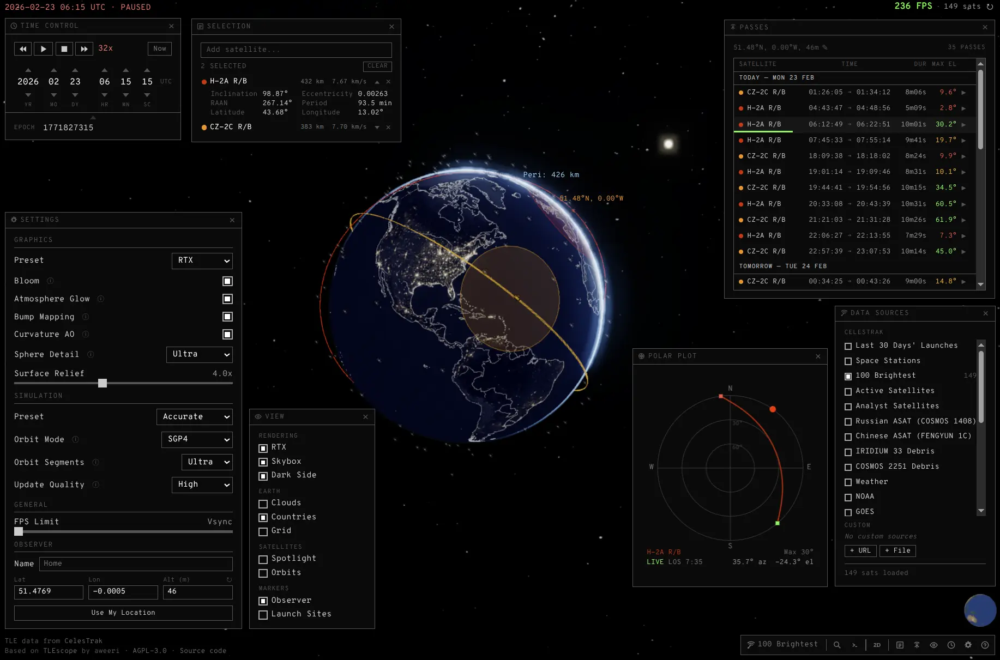
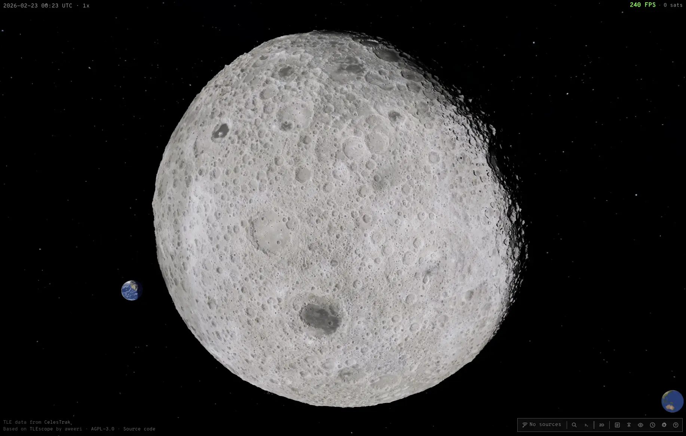
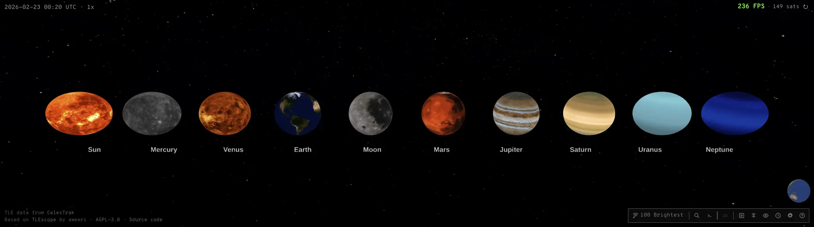

# Threescope

A browser-based satellite tracker built with Three.js and Svelte. Runs as a static web app with PWA support — installable and usable offline on any device.

**[threescope.imsandra.fyi](https://threescope.imsandra.fyi/)**





## Features

- **3D and 2D views** — interactive globe with atmosphere, clouds, night lights, and an equirectangular map projection
- **Real-time satellite tracking** — SGP4 propagation with orbit trails, ground tracks, footprints, and periapsis/apoapsis markers
- **Multi-source TLE data** — load from CelesTrak categories or custom URLs/files, with caching and deduplication
- **Satellite pass predictor** — Web Worker-based computation with a sortable pass list and polar plot
- **Solar system orrery** — Sun, Moon, and all planets with accurate positions and textures
- **Observer location** — configurable via settings, browser geolocation, or dragging the map pin
- **Time control** — pause, speed up/slow down, warp to specific times, Unix epoch input
- **Command palette** — quick access to all actions via `Ctrl+K`
- **Configurable graphics** — bloom, bump mapping, atmosphere glow, surface relief, sphere detail presets

## Development

```bash
npm install
npm run dev
```

Build for production:

```bash
npm run build
```

Output goes to `dist/`, deployable to any static host.

## Attribution

Based on [TLEscope](https://github.com/aweeri/TLEscope) by [aweeri](https://github.com/aweeri). TLE data from [CelesTrak](https://celestrak.org).

Licensed under [AGPL-3.0](https://www.gnu.org/licenses/agpl-3.0.html).
