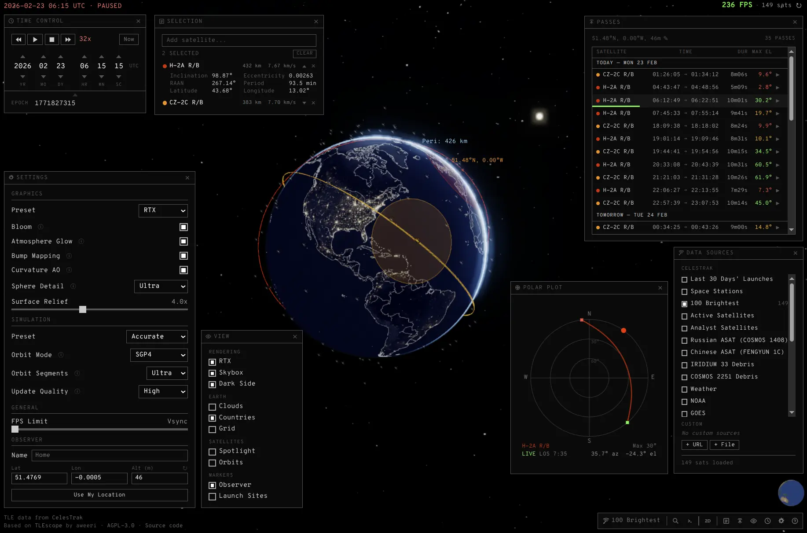
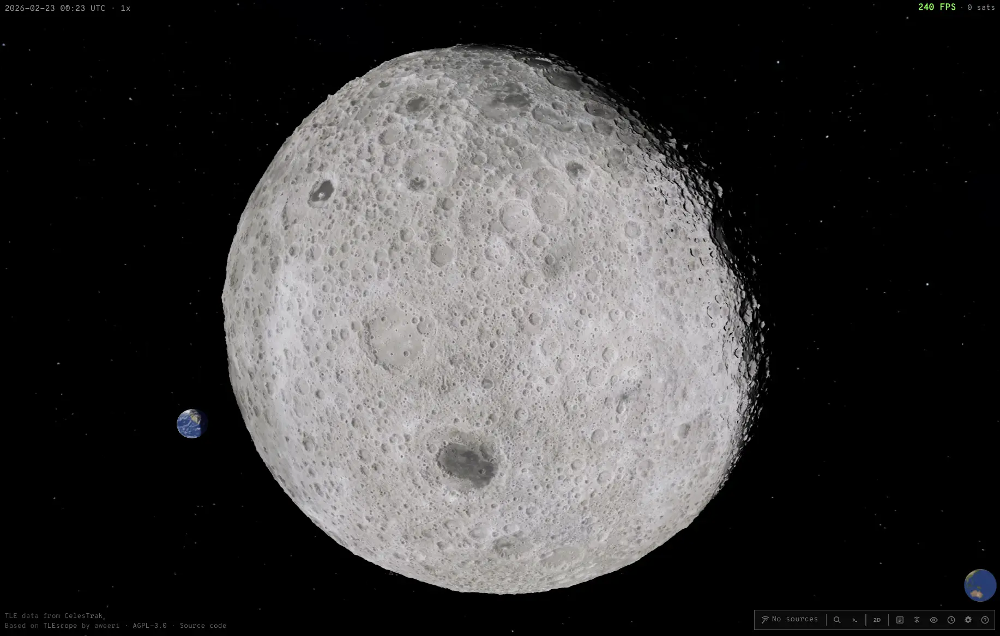
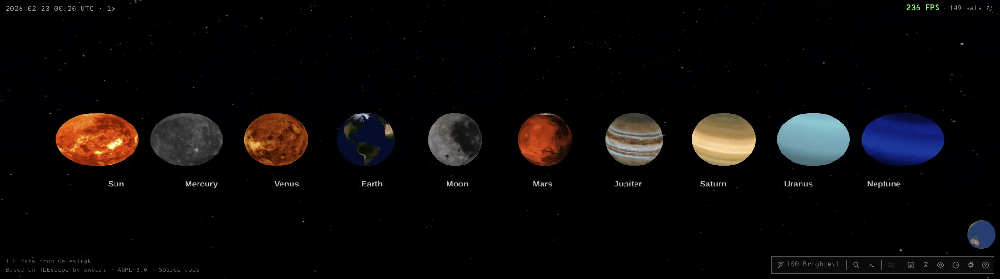

# Satvisor

A browser-based satellite tracker built with Three.js and Svelte. Runs as a static web app with PWA support — installable and usable offline on any device.

**[satvisor.com](https://satvisor.com/)**





## Features

### Satellite Tracking

- **Real-time SGP4 propagation** — orbit trails, ground tracks, footprints, periapsis/apoapsis markers
- **Multi-source TLE data** — CelesTrak categories, custom URLs, pasted TLE files, per-source toggle, caching with staleness warnings
- **SatNOGS database** — browse satellites with metadata, transmitter lists, frequency and status filters, satellite images
- **Selection** — search by name or NORAD ID, multi/single select, per-satellite visibility toggle

### Pass Prediction

- **Pass predictor** — Web Worker background computation, day-grouped sortable pass table with eclipse and magnitude indicators
- **Polar plot** — sky track with eclipse coloring, AOS/LOS markers, live position dot, time scrubbing
- **Pass filters** — interactive polar plot editor with draggable elevation/azimuth handles, horizon mask, frequency range, visibility mode, minimum duration
- **Doppler shift** — real-time Doppler curve with SatNOGS transmitter prefill, hover readout, CSV export
- **Visual magnitude** — phase-corrected brightness estimation with atmospheric extinction

### Views and Rendering

- **3D globe** — atmosphere glow, cloud layer, night lights, bump mapping, ambient occlusion, surface relief
- **2D map** — equirectangular projection with country borders and grid overlay
- **Solar system orrery** — Sun, Moon, and all 8 planets with textures, bump maps, and displacement mapping
- **Graphics presets** — Standard and RTX, with per-setting control (bloom, sphere detail, orbit segments, surface relief)

### Simulation

- **Orbit modes** — analytical (Keplerian with optional J2 precession and atmospheric drag) or full SGP4/SDP4
- **Time control** — pause, speed up/slow down, warp to specific times, epoch input

### Observer

- **Location** — coordinates with auto-altitude from elevation data, browser geolocation
- **Sky data** — sun elevation with twilight classification, moon elevation and illumination, observation window timing

### Theming

- **12 built-in themes** — including Everforest, Gruvbox, Solarized, Nord, Tokyo Night, Dracula, Catppuccin
- **Theme editor** — live color editing, clone, import/export as JSON

### General

- **Command palette** — `Ctrl+K` for satellite search, epoch jump, view toggles, planet navigation
- **PWA** — installable, offline-capable

## Development

Some dependencies are published to GitHub Packages under the `@satvisorcom` scope. The `.npmrc` in the repo configures the registry, but you need a GitHub personal access token with `read:packages` scope:

```bash
echo "//npm.pkg.github.com/:_authToken=YOUR_TOKEN" >> ~/.npmrc
npm install
npm run dev
```

Build for production:

```bash
npm run build
```

Output goes to `dist/`, deployable to any static host.

## Self-Hosting

Satvisor can run fully self-contained with no external internet access. All external data dependencies are configurable via build-time environment variables.

### Environment Variables

| Variable | Default | Description |
|----------|---------|-------------|
| `VITE_TEXTURE_QUALITY` | *(user choice)* | Force `lite` or `full` texture mode and hide the user toggle. Lite reduces initial download from ~26 MB to ~2 MB |
| `VITE_DATA_MIRROR` | `https://raw.githubusercontent.com/satvisorcom/satvisor-data/master` | Base URL for TLE data and satellite catalogs (stdmag, satnogs) |
| `VITE_CELESTRAK_BASE` | `https://celestrak.org` | Base URL for CelesTrak direct TLE fallback |
| `VITE_SATNOGS_BASE` | `https://db.satnogs.org` | Base URL for SatNOGS satellite images and pages |
| `VITE_TLE_CACHE_MAX_AGE_H` | `1` | Hours before cached TLE data is considered stale and refetched |
| `VITE_TLE_CACHE_EVICT_AGE_H` | `24` | Hours after which TLE caches are deleted on startup. Skipped when offline. Set `0` to disable (keeps TLE data indefinitely — useful for offline deployments) |
| `VITE_FEEDBACK_TOYS` | `true` | Enable Bluetooth toy feedback integration. Set `false` to remove the feature entirely (hides UI, prevents WASM load) |

### Air-Gapped / Offline Deployment

To run Satvisor on an isolated network with no internet:

1. **Clone the [satvisor-data](https://github.com/satvisorcom/satvisor-data) repo** and serve it from your local server (e.g. at `/data-mirror/`)

2. **Build with all URLs pointed locally:**
   ```bash
   VITE_TEXTURE_QUALITY=lite \
   VITE_DATA_MIRROR=/data-mirror \
   VITE_CELESTRAK_BASE= \
   VITE_SATNOGS_BASE= \
   VITE_TLE_CACHE_EVICT_AGE_H=0 \
     npm run build
   ```

3. **Deploy `dist/`** to any static file server (nginx, caddy, python -m http.server, etc.)

Setting `VITE_CELESTRAK_BASE` to empty disables the CelesTrak fallback — TLE data will only come from the mirror. Setting `VITE_SATNOGS_BASE` to empty means satellite images won't load, but everything else works.

The data mirror must follow the same directory structure:
```
<mirror>/celestrak/json/{group}.json       # TLE data per source
<mirror>/celestrak/special/json/{group}.json  # Special TLE sources
<mirror>/catalog/stdmag.json               # Visual magnitude catalog
<mirror>/catalog/satnogs.json              # SatNOGS satellite metadata
<mirror>/manifest.json                     # Source manifest (optional)
```

After first load, the service worker caches all static assets (JS, CSS, textures) — subsequent visits work fully offline. TLE data is cached in localStorage for 24 hours.

## Credits

- TLE data from [CelesTrak](https://celestrak.org)
- Satellite metadata from [SatNOGS](https://satnogs.org)
- Moon textures from [NASA SVS CGI Moon Kit](https://svs.gsfc.nasa.gov/4720/)
- Planet textures from [Solar System Scope](https://www.solarsystemscope.com/textures/)
- Inspired by [TLEscope](https://github.com/aweeri/TLEscope) by [aweeri](https://github.com/aweeri)

## License

[AGPL-3.0](https://www.gnu.org/licenses/agpl-3.0.html)
